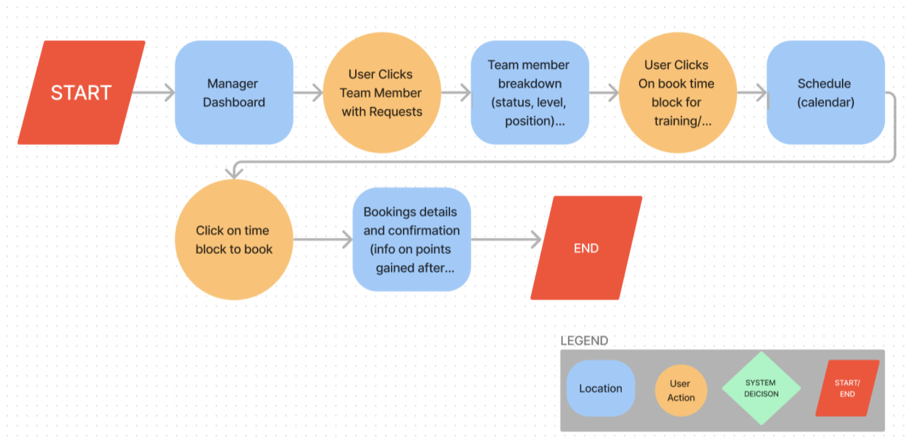

## Description

This project is a industry hackathon for [7Shifts](https://www.7shifts.com/) that was completed at Brainstation with the collaboration of [Daniel Martin](https://www.linkedin.com/in/danieljcmartin/) (UX), [Leila Golestanha](https://www.linkedin.com/in/leilagolestanha/) (UX), [Violet Wang](https://www.linkedin.com/in/violetcwang/) (UX), [Nicholas Huynh](https://www.linkedin.com/in/nickhuynhq/) (WebDev) and [Li Yu](https://www.linkedin.com/in/li-yu-developer/) (WebDev).

### Problem

7Shifts presented a simple yet complicated problem:

**Problem Space:** Employee turnover rate in the restaurant industry is at an all time high.

## Research

### Initial research

* Turnover rate of 70%, reaching a new high of 140% in 2022 - Forbes
* More than 70% job positions vacant, and 3 out of 4 employees planning to leave in the next year. 

**Initial How Might We:** Help restaurants hire and retain employees?

### Secondary Research

* People think of restaurant industry positions as a stepping stone in their career 
* Lack of sufficient training, 70% of employees feel they do not have hands on training from their managers.
* Lack of team building activities and career progression opportunities.

### Summary: Feeling Valued

All of these issues add up to the overall problem of “feeling valued”.  
How can we tell a new narrative to current and prospective employees that show upward career mobility?

**Revised How Might We:** How might we help managers make their staff feel more valued through digital solutions, in order to improve retention?

## Proposition

After analysing existing features on 7Shifts platform and competitor platform, we have found a way for 7Shifts to standout.  
Focus on employee infrastructure, with the goal of scaling the business through retaining employees.

### Skillbuilding

* A new feature that focuses on creating opportunities for employees to grow in their career
* Build towards growing their individual abilities, with the potential for employees to receive promotion.
* Reduce feelings of stagnancy, and show employees the value of building their skills in the restaurant industry as a career.
* Research reinforces that it costs less to train employees than constantly hire, so why not focus on the team you have?

## Task Flow and Sketches - Skillbuilding

  
   

## Final build

With the task flow in mind and the the sketches established, we were able to proceed to build our solution to the problem.

<kbd></kbd>
